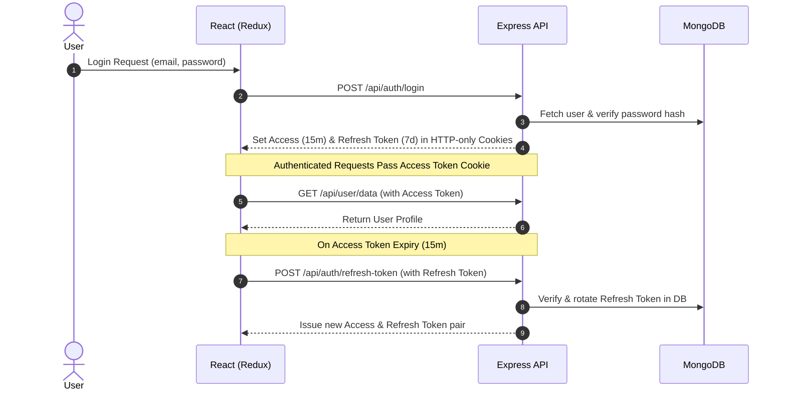

<div align="center">

  

  # 🔐 Modern MERN Authentication Starter

  **Production-grade, security-hardened authentication boilerplate for full-stack Node.js & React applications.**

  [](LICENSE)
  [](https://nodejs.org)
  [](https://react.dev)
  [](https://tailwindcss.com)
  [](https://expressjs.com)
  [](https://mongodb.com)

  [Key Features](#-key-features) •
  [Architecture](#-architecture) •
  [Getting Started](#-getting-started) •
  [API Endpoints](#-api-endpoints) •
  [Security](#-security-features) •
  [Testing](#-testing)

</div>

---

## ⚡ Overview

A complete, feature-rich authentication solution built on the **MERN Stack** (MongoDB, Express, React, Node.js). Designed out of the box with modern security best practices including short-lived Access Tokens, Refresh Token Rotation with database revocation, hashed OTP generation for email verification and password resets, IP-based rate limiting, and HTTP-only secure cookie delivery.

---

## ✨ Key Features

- 🔐 **Dual-Token System**: Short-lived Access Token (`15m`) + Long-lived Refresh Token (`7d`).
- 🔄 **Refresh Token Rotation & Revocation**: Automatic rotation on refresh with immediate revocation on logout or reuse detection.
- 🛡️ **Hashed OTP Storage**: SHA-256 hashed OTPs stored in database with timing-safe comparison (`crypto.timingSafeEqual`).
- 🛑 **Rate Limiting Protection**: `express-rate-limit` protecting auth & OTP endpoints from brute-force attacks.
- 🍪 **Secure Cookie Transport**: Configured with `httpOnly`, `secure`, and `sameSite` flags to prevent XSS & CSRF credential theft.
- 🧠 **Redux Toolkit Integration**: Global authentication state management with Redux Async Thunks.
- 🎨 **Modern UI Components**: React 19 interface styled with Tailwind CSS and Lucide React icons.
- 🛡️ **Startup Environment Validation**: Automatic schema verification of critical server environment variables.
- 🧪 **Zero-Config Testing**: Automated integration test suite powered by Vitest & `mongodb-memory-server`.

---

## 🏗️ Architecture



---

## 🛠️ Tech Stack

### Backend
- **Core**: Node.js, Express.js
- **Database**: MongoDB & Mongoose ORM
- **Security**: JWT (`jsonwebtoken`), `bcryptjs`, SHA-256 (`crypto`), `helmet`, `express-rate-limit`, `cookie-parser`
- **Email Dispatch**: `nodemailer`
- **Testing**: `vitest`, `supertest`, `mongodb-memory-server`

### Frontend
- **Core**: React 19, Vite
- **State**: Redux Toolkit (`@reduxjs/toolkit`), `react-redux`
- **Routing & HTTP**: `react-router-dom`, `axios` (with `withCredentials: true`)
- **Styling & UI**: Tailwind CSS, `lucide-react`, `react-toastify`

---

## 📁 Repository Structure

```text
MERN-AUTH/
├── backend/
│   ├── Config/          # MongoDB, Mailer, & Env Validation logic
│   ├── controller/      # Auth & User business logic
│   ├── middleware/      # Auth & Rate limiter middlewares
│   ├── model/           # Mongoose schemas
│   ├── routes/          # API route definitions
│   ├── tests/           # Integration test suite
│   ├── .env.example     # Safe backend env template
│   └── server.js        # Entry point
├── frontend/
│   ├── src/
│   │   ├── components/  # Reusable UI components
│   │   ├── pages/       # Login, Register, Verify, Reset pages
│   │   └── redux/       # Auth slices and Async Thunks
│   ├── .env.example     # Safe frontend env template
│   └── vite.config.js
└── README.md
```

---

## 🚀 Getting Started

### Prerequisites

- **Node.js**: `v18.0.0` or higher
- **npm**: `v9.0.0` or higher
- **MongoDB**: Local instance or [MongoDB Atlas](https://www.mongodb.com/cloud/atlas)
- **SMTP Provider**: SMTP credentials for sending verification emails (e.g., Brevo, SendGrid, Gmail)

### 1️⃣ Clone & Setup Environment

```bash
# Clone the repository
git clone https://github.com/wahidulsami/MERN-AUTH.git
cd MERN-AUTH

# Set up environment files
cp backend/.env.example backend/.env
cp frontend/.env.example frontend/.env
```

### 2️⃣ Configure Environment Variables

Edit `backend/.env`:

```env
PORT=3000
NODE_ENV=development
MONGODB_URI=mongodb://localhost:27017/mern-auth
JWT_SECRET=your_super_secret_access_key
REFRESH_TOKEN_SECRET=your_super_secret_refresh_key
SENDER_EMAIL=noreply@yourdomain.com
SMTP_HOST=smtp.example.com
SMTP_PORT=587
SMTP_USER=your_smtp_username
SMTP_PASS=your_smtp_password
```

Edit `frontend/.env`:

```env
VITE_BECKEND_URL=http://localhost:3000
```

### 3️⃣ Run Application

**Start Backend**:
```bash
cd backend
npm install
npm run dev
```

**Start Frontend** (in a new terminal):
```bash
cd frontend
npm install
npm run dev
```

Visit `http://localhost:5173` in your browser.

---

## 📡 API Endpoints

### 🔐 Authentication Routes (`/api/auth`)

| Method | Endpoint | Access | Description | Rate Limit |
|---|---|---|---|---|
| `POST` | `/register` | Public | Register new user | 10 req / 15m |
| `POST` | `/login` | Public | Authenticate user & issue cookie tokens | 10 req / 15m |
| `POST` | `/logout` | Public | Revoke session & clear HTTP cookies | - |
| `POST` | `/refresh-token` | Public | Rotate refresh token & issue new token pair | - |
| `GET` | `/is-Auth` | Protected | Verify active authenticated session | - |
| `POST` | `/send-verify-otp` | Protected | Send 6-digit email verification OTP | 5 req / 15m |
| `POST` | `/verfiy-account` | Protected | Verify email using 6-digit OTP | - |
| `POST` | `/send-reset-otp` | Public | Request password reset OTP via email | 5 req / 15m |
| `POST` | `/reset-password` | Public | Reset password using verified OTP | - |

### 👤 User Routes (`/api/user`)

| Method | Endpoint | Access | Description |
|---|---|---|---|
| `GET` | `/data` | Protected | Fetch profile details of logged-in user |

---

## 🔒 Security Features

- **Salted Password Hashing**: Passwords hashed with `bcryptjs` (cost factor 10).
- **Hashed OTP Storage**: Raw 6-digit OTPs are never stored in DB; only SHA-256 hashes are saved.
- **Timing-Attack Resistance**: OTP matching performed using `crypto.timingSafeEqual`.
- **XSS & CSRF Mitigations**: Session tokens are passed exclusively in `httpOnly` secure cookies with strict `sameSite` policies.
- **IP Rate Limiting**: Endpoint-specific limits using `express-rate-limit` to prevent brute-force attacks.
- **Startup Protection**: Application validates all required env variables before starting up.

---

## 🧪 Testing

The backend includes automated integration tests using **Vitest** and **In-Memory MongoDB**:

```bash
cd backend
npm test
```

---

## 📄 License

Distributed under the MIT License. See [`LICENSE`](LICENSE) for more information.

<div align="center">
  <sub>Built with ❤️ for the open-source community by <a href="https://github.com/wahidulsami">Wahidul Islam Sami</a></sub>
</div>
